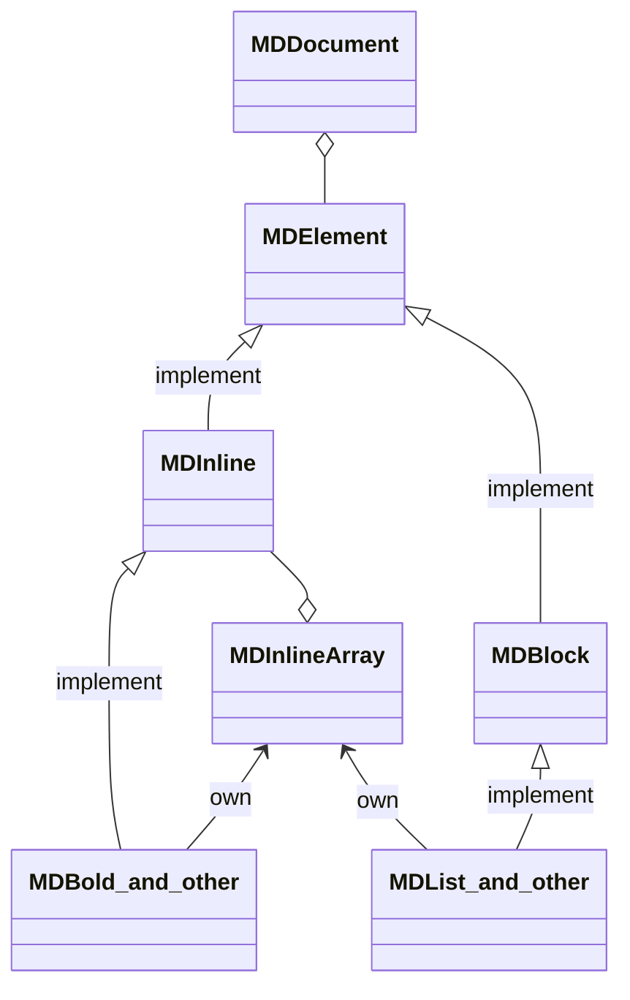

```mermaid
classDiagram
MDDocument o-- MDElement
MDElement <|-- MDInline: implement
MDInline --o MDInlineArray
MDInline <|-- MDBold_and_other: implement
MDInlineArray <-- MDBold_and_other: own
MDElement <|-- MDBlock: implement
MDInlineArray <-- MDList_and_other: own
MDBlock <|-- MDList_and_other: implement
```